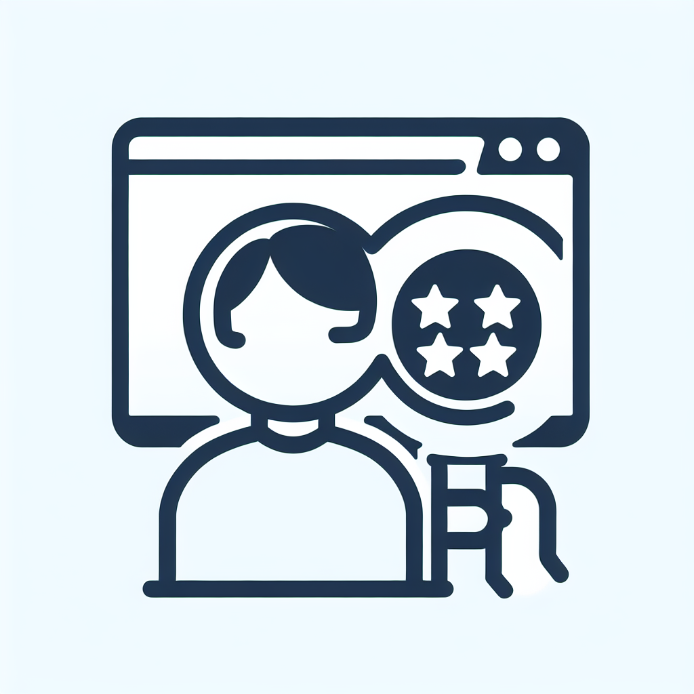
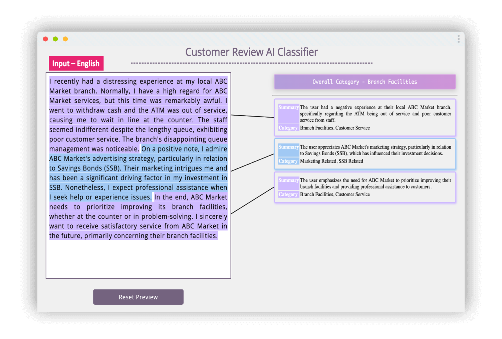
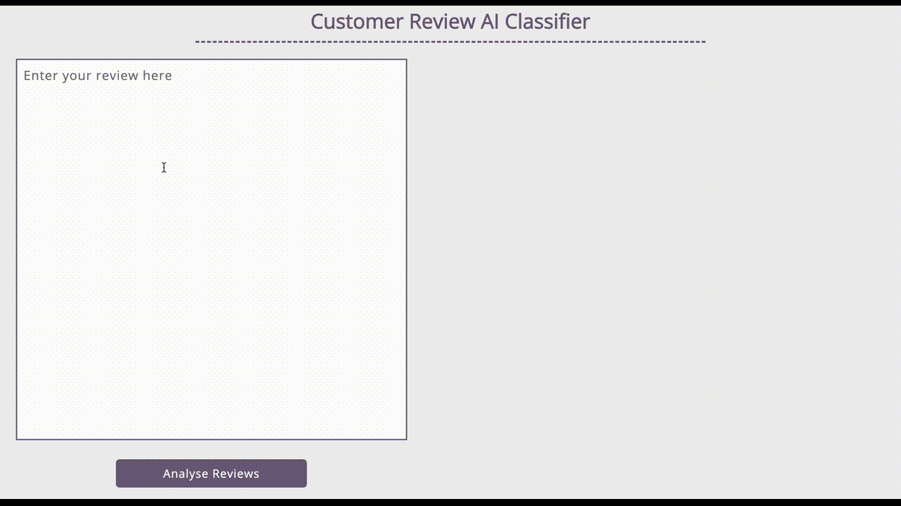

<!-- HEADER -->
<a id="readme-top"></a>

<br />
<div align="center">
  <a href="https://github.com/vinc1am/customer-review-classifier">
    
  </a>

  <h3 align="center">Customer Review Classifier</h3>

  <p align="center">
    Super Simple App to analyse and classify the customer reviews
    <br />
  </p>

  [![MIT License][license-shield]][license-url]
  [![Website][website-shield]][website-url]

</div>

<details>
  <summary>Table of Contents</summary>
  <ol>
    <li><a href="#about-the-project">Overview</a></li>
    <li><a href="#getting-started">Installation</a></li>
    <li><a href="#usage">Usage</a></li>
    <li><a href="#roadmap">Roadmap</a></li>
    <li><a href="#license">License</a></li>
  </ol>
</details>


<!-- Overview -->
## Overview



Customer Review Classifier is a super simple application to demonstrate the usage of LLM to analyze and classify reviews into different categories with detailed explanations.

**Key Features Include:**

* Extract the main idea from the reviews
* Analyze the review and conclude the overall category
* Support multiple languages for reviews

To get started with the application, execute `python app.py`.


<!-- GETTING STARTED -->
## Getting Started

Here are the instructions on setting up the project locally. To get a local copy up and running, please follow these steps:

### Installation

1. Clone the repo
   ```sh
   git clone https://github.com/vinc1am/customer-review-classifier
   ```
2. Go to your project folder and install the required Python packages
   ```sh
   pip install -r requirements.txt
   ```
3. Rename .env.template as .env. Fill in the parameters
   ```sh
    OPENAI_API_TYPE=
    OPENAI_API_BASE=
    OPENAI_API_VERSION=
    OPENAI_API_KEY=
    OPENAI_ENGINE=
   ```
4. Run the script to install the necessary packages
   ```sh
   python app.py
   ```


<!-- USAGE EXAMPLES -->
## Usage



### Extract the main idea from the reviews:
Use Azure Text Analytics to extract key phrases and main ideas from the reviews.

### Analyze the review and conclude the overall category:
Utilize Azure OpenAI GPT to analyze the extracted main ideas and categorize the reviews into predefined categories (e.g., positive, negative, neutral, product features, customer service, etc.).

### Support multiple languages for reviews:
Implement Azure Cognitive Services Translator to translate reviews into a common language for consistent analysis, if they are not already in the desired language.


<!-- ROADMAP -->
## Roadmap

- [x] Prompt to analyse and classify the reviews
- [x] User Interface


<!-- LICENSE -->
## License

Distributed under the MIT License. See `LICENSE.txt` for more information.


<p align="right" style="font-family:verdana;font-size:80%;color:blue"><b><a href="#readme-top" >Back to Top</a></b></p>


<!-- MARKDOWN LINKS & IMAGES -->
[license-shield]: https://img.shields.io/badge/License-MIT-yellow.svg
[license-url]: https://opensource.org/licenses/MIT
[website-shield]: https://img.shields.io/badge/Website-blue.svg
[website-url]: https://www.vinc1am.com/gallery.html#featured
[linkedin-shield]: https://img.shields.io/badge/LinkedIn-blue.svg
[linkedin-url]: https://www.linkedin.com/in/vinc1am/

